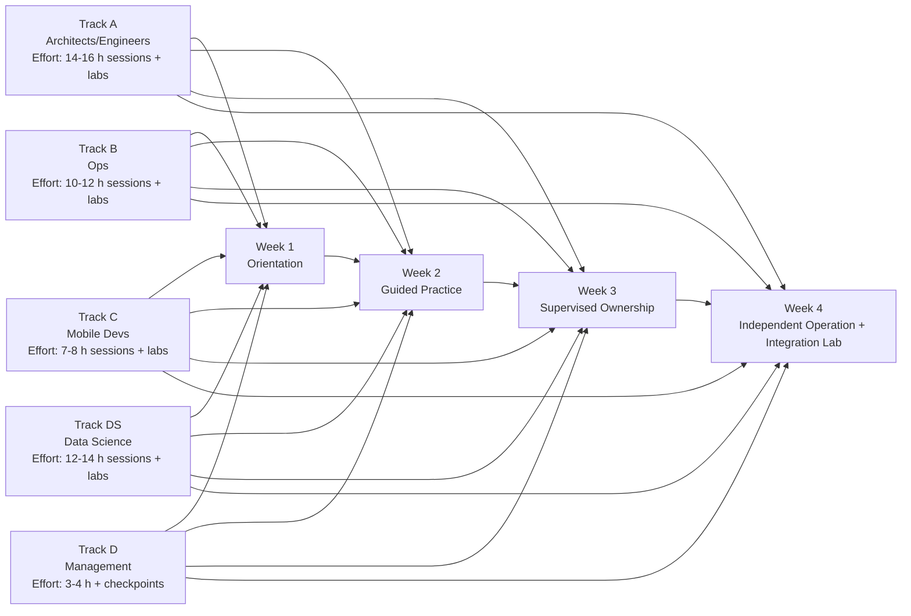

# Multi-platform Vertical AI - motivation, method, knowledge, code, environment.

**Author** : IV SAI Innovation lead, August 18, 2026

## Strategic Intro: Why This Knowledge-Centric SDLC Is Foundational

This repository is not just code but a form of **LLM wiki plus execution system**: architecture intent, product constraints, runbooks, and delivery plans are all captured close to the implementation and kept operational through scripts, tests, and measurable gates.

This approach is similar to the "LLM wiki" idea: knowledge is first-class, queryable, and continuously updated by engineering work. The practical difference is that this repo goes one step further. It does not stop at documentation retrieval; it links knowledge to build paths, runtime boundaries, eval harnesses, and release decisions.

### Clarification: Not Merely "AI-Generated Code"

This repository should not be described as simply "AI-generated." That framing is too shallow and can mislead stakeholders. The stronger and more accurate framing is: **AI-assisted, human-directed, knowledge-centric SDLC**.

The distinction matters:

| Misleading framing | More accurate framing |
|---|---|
| "The repo was AI-generated" | Human-directed development using AI assistance for research, design synthesis, implementation support, and review |
| "The value is code output speed" | The value is accumulated product, architecture, runtime, eval, and operations knowledge made executable |
| "Docs explain the code after the fact" | Business, design, and planning knowledge actively guide what code should exist and how it should evolve |
| "AI replaces engineering judgment" | AI amplifies engineering judgment by keeping constraints, decisions, and tradeoffs available during development |

In this model, the LLM is not treated as an autonomous author of the product. It is treated as a **knowledge amplifier and reasoning assistant** inside a disciplined SDLC. Humans still own product intent, architecture decisions, risk acceptance, value & release governance, and final accountability.

That clarification is important for executives: the competitive edge is not that a model can write code. Competitors can also generate code. The edge is that the organization can preserve and reuse its reasoning: why a runtime seam exists, why an eval gate matters, why a model promotion was accepted, and which roadmap assumptions must be revisited.

For a multi-platform vertical AI product, that is a power edge because complexity compounds across four axes/edges at once:

1. business domain surface (business rules, eval criteria, release thresholds)
2. model surface (baseline, fine-tuned variants)
3. language & platform surface (Swift/Python, Linux/macOS/iOS)
4. runtime surface (on-device, backend, GPU)


Without a knowledge-centric SDLC, teams repeatedly relearn the same decisions, reintroduce old mistakes, and slow down as headcount grows. With this model, decisions become assets: explicit, testable, and reusable.

### Objective Case For Organizational Advantage

1. **Faster alignment with less overhead**
   - Product, engineering, ops, and data science can reason from the same artifacts instead of conflicting slide decks and tribal memory.
2. **Better decision quality under uncertainty**
   - Product direction and management decisions are tied to evidence (eval deltas, reproducibility, operational gates), not confidence theater.
3. **Higher parallelism with lower coordination tax**
   - Stable seams (runtime adapters, backend contracts, data synthesis specs, eval boundaries) let teams move independently with minimal drift.
4. **Compounding learning loop**
   - Every incident, experiment, and model promotion can harden runbooks, metrics, and policy gates, raising organizational IQ over time.

### Stakeholder Relevance

1. **Executives and product owners**
   - Gain a decision-ready view of risk, cost, and release readiness with explicit gates and assumptions.
2. **Architects and engineers**
   - Gain durable system seams and clearer ownership boundaries, reducing redesign churn.
3. **Ops**
   - Gain repeatable recovery and validation workflows, reducing support entropy as adoption scales.
4. **Data science and eval owners**
   - Gain reproducible, diagnosable quality governance that supports safe model iteration.

### Management Decision Advantage

For executives and product owners, the main advantage is not more documentation. It is **higher-quality decisions with less ambiguity**. A knowledge-centric SDLC gives management a live decision surface: business intent, architecture tradeoffs, delivery status, operational risk, and eval evidence are connected instead of scattered across meetings, chats, and stale slides.

This changes management work in practical ways:

1. **From opinion reviews to evidence reviews**
   - Instead of asking whether a feature or model "looks good," leaders can ask which eval gates passed, which rubric bands moved, which scenarios remain uncovered, and what changed since the last baseline.
2. **From one-time approvals to staged investment gates**
   - Decisions such as GPU expansion, hardware provisioning, CI gating, or model release cadence can be tied to thresholds (`P_eval_repro`, `BI_vertical`, `MTTR_env`, `P_build`) rather than intuition alone.
3. **From roadmap debate to dependency-aware sequencing**
   - Planning-domain docs show which workstreams depend on environment readiness, runtime seams, eval maturity, or Apple validation. This prevents funding the right idea in the wrong order.
4. **From hidden technical debt to visible decision debt**
   - If a shortcut is taken (for example mock-only validation, delayed environment or technology adoption, or GPU serving before readiness), the tradeoff can be recorded with an owner and revisit date.
5. **From product requirements to measurable AI behavior**
   - Business-domain rules become eval scenarios and release gates. Product owners can trace a requirement from domain intent to model behavior, instead of accepting demos as proof.
6. **From headcount scaling to capability scaling**
   - Management can see whether adding people will increase throughput or only increase coordination cost, because onboarding, build reliability, ops recovery, and eval maturity are measured.

The decision-maker benefit is therefore concrete: fewer premature bets, faster course correction, and better timing of investments. The organization does not need perfect certainty; it needs a system that makes uncertainty explicit and turns it into managed options.

This is not achievable with meeting-centric knowledge flows alone. Meetings are useful for alignment, but they are weak as the primary system of record for a vertical AI product because they lose structure, provenance, and executability.

Meeting-centric knowledge flow breaks down in six predictable ways:

1. **Context evaporates after the meeting**
   - The why behind a decision is reduced to memory, a chat summary, or a slide. New team members inherit conclusions without constraints, assumptions, or rejected alternatives.
2. **Decisions detach from evidence**
   - A model may be promoted because a demo looked good, while eval deltas, scenario coverage, judge variance, and runtime readiness remain scattered or unreviewed.
3. **Dependencies become invisible**
   - A roadmap discussion can approve Apple work, GPU expansion, or CI gating without seeing the prerequisite design boundaries, toolchain maturity, or eval reproducibility gates.
4. **Risk owners and revisit dates disappear**
   - Meeting notes rarely preserve decision debt in a way that is enforceable. The organization remembers that a shortcut was taken only after it fails.
5. **Knowledge cannot be executed**
   - A meeting cannot run `automated validations`, replay an LLM eval, compare model checkpoints, or prove a build path. A knowledge-centric repo connects intent to executable verification.
6. **Scaling adds noise instead of leverage**
   - As the team grows, more meetings create more interpretations. A shared knowledge base creates a common operating memory that lets more people act independently.

The right model is therefore not "no meetings." It is **meetings as synchronization, repository knowledge as operating memory**. Meetings decide and align; the repo preserves the decision, links it to evidence, and makes it testable.

Effective decisions enabled by this method include:

| Management decision | What the knowledge-centric SDLC adds |
|---|---|
| Fund GPU capacity or keep scheduled sharing | Evidence from GPU preflight, blocked-time trends, eval demand, and `MTTR_env` |
| Promote a fine-tuned model | Side-by-side eval deltas, reproducibility score, rubric movement, and recommendation pack |
| Scale the team from 7 to 10+ | Onboarding time, build success, support load, and track maturity evidence |
| Invest in Apple validation hardware | Roadmap dependency on iOS/macOS proof, not generic desire for native coverage |
| Make CI eval gates mandatory | Eval stability, judge variance, and false-positive/false-negative risk estimates |
| Prioritize product behavior changes | Business-rule coverage, scenario gaps, and user-risk mapping |

### Entrepreneurial Insight: Why This Matters For AI Startups And Software Factories

For an AI startup, the scarce resource is not code generation. It is **validated learning under time pressure**: knowing which product behavior matters, which architecture choices can scale, which model changes improve outcomes, and which operational risks can block delivery. A knowledge-centric repo turns that learning into compounding company memory.

For a software factory, the scarce resource is not individual developer output. It is **repeatable delivery quality across teams and products**. This method makes the factory less dependent on hero engineers because the reasoning, seams, runbooks, and release gates are explicit.

Key entrepreneurial advantages:

1. **Founder-speed without founder bottlenecks**
   - Early-stage product knowledge is captured as business rules, design decisions, eval criteria, and operating procedures instead of staying in one founder/architect's head.
2. **Faster customer-to-roadmap translation**
   - Customer/product insights can become business-domain rules, then eval scenarios, then release gates. This compresses the path from market learning to product behavior.
3. **Reusable vertical AI factory pattern**
   - Once the pattern works for a shopping assistant, the same operating model can be reused for other vertical assistants: domain glossary, policy gates, synthetic data, eval packs, runtime adapters, and platform shells.
4. **Investor and leadership confidence**
   - The organization can show not only demos, but a system for repeatably improving quality: model deltas, eval reproducibility, promotion decisions, and operational readiness.
5. **Lower scaling fragility**
   - As team size grows, the method reduces dependence on informal context transfer. New teams inherit a decision graph and execution workflow, not just a codebase.

The startup lesson is direct: AI-native companies win when they can learn faster than competitors **and** turn that learning into reliable product behavior. This repo is a prototype of that operating system.

### Motivating But Realistic Framing

This model is not a shortcut and not "documentation theater." It requires discipline: explicit decisions, measurable criteria, and regular recalibration. But in organizations building vertical AI products, that discipline is exactly what converts rapid experimentation into reliable delivery.

At this time, this codebase materializes only part of the operating model described in this document. Several topics are implemented or directly supported by scripts, modules, and tests; others are design-validated, roadmap-defined, or process-ready but still require adoption work, hardening, and recurring governance. This is intentional: the document should be read as both a validation of current capabilities and a staged target architecture for how the repo can mature into a fuller knowledge-centric SDLC system.

The strategic payoff is durable: the organization becomes faster **because it remembers better**, and safer **because it decides with evidence**.

## Purpose

This document validates the stated developer use cases against the repo's modules, environments, and runtime contracts. It also adds extended use cases and an adoption roadmap with quantified value and benefit models.

## Scope

Team size: 7 developers  
Primary environment: shared Linux machine + remote GPU machine  
Secondary targets: macOS (dev approximation), iOS (via Apple hardware)  
Repository model: monorepo under `src/` with module-per-concern separation

---

## Table Of Contents

- [Strategic Intro: Why This Knowledge-Centric SDLC Is Foundational](#strategic-intro-why-this-knowledge-centric-sdlc-is-foundational)
- [Prompt](#prompt)
- [Purpose](#purpose)
- [Scope](#scope)
- [Executive Edition (One-Screen Summary)](#executive-edition-one-screen-summary)
- [Verified Use Cases](#verified-use-cases)
- [Elaborated Use Cases](#elaborated-use-cases)
- [Use Case Summary](#use-case-summary)
- [Knowledge Transfer Roadmap](#knowledge-transfer-roadmap)
- [Monetary value model for management (explicit):](#monetary-value-model-for-management-explicit)
- [Companion Documents](#companion-documents)

---

## Executive Edition (One-Screen Summary)

### Capability Themes At A Glance

This executive view avoids duplicating the detailed use-case matrix. It groups the 21 use cases into capability themes; the canonical per-use-case status table is in [Use Case Summary](#use-case-summary).

| Capability theme | Covered use cases | Executive takeaway | Primary open decision |
|---|---|---|---|
| Reproducible team development environment | UC_DEV_01, UC_DEV_02, UC_DEV_05, UC_DEV_12, UC_DEV_15 | The shared Linux + Flox/Nix model is viable for a 7-person monorepo team if each developer has an isolated clone/worktree and local writable caches. | Confirm shared Linux machine as default operating model. |
| Multi-platform application delivery | UC_DEV_03, UC_DEV_07, UC_DEV_10 | Swift app work can proceed on Linux with backend/mocking seams while Apple hardware is reserved for validation milestones. | Decide when Apple validation hardware becomes mandatory. |
| Parallel inference and model-version comparison | UC_DEV_04, UC_DEV_09, UC_DEV_13 | CPU-path inference is developer-safe; GPU-path work needs scheduling, preflight, and checkpoint metadata discipline. | Choose GPU scheduling/MIG/cloud policy. |
| Artifact, dataset, and environment governance | UC_DEV_06, UC_DEV_11, UC_DEV_19 | Shared MinIO/DVC-style artifact governance prevents model and eval-data drift as the team scales. | Make MinIO/shared artifact storage canonical. |
| Vertical AI eval and release governance | UC_DEV_08, UC_DEV_14, UC_DEV_16, UC_DEV_17, UC_DEV_18, UC_DEV_20, UC_DEV_21 | Model promotion can become evidence-based through reproducible evals, policy gates, rubric scoring, judge-variance control, and recommendation packs. | Define promotion gates and release thresholds. |
| Cross-functional operating model | All use cases + stakeholder tracks | The environment only compounds if engineering, ops, mobile, data science, and management each own their practiced part of the workflow. | Fund staged knowledge transfer and monthly KPI review. |

### Track Summaries At A Glance

| Track | Mission | Effort | Mid-term KPI focus | Long-term outcome |
|---|---|---|---|---|
| A — Architects/Engineers | Own runtime, contracts, module reliability | 3-4 weeks | `P_build`, `D_detect`, `N_fail_late` | Reusable architecture patterns, lower rework |
| B — Ops | Operate shared env, GPU readiness, recovery | 1.5-2 weeks | `MTTR_env`, `B_block` | Scalable ops without linear headcount growth |
| C — Mobile | Deliver app features independent of model infra | 1 week | blocked stories, integration pass trend | Stable cadence across backend/model changes |
| DS — Data Science | Own eval quality, synthesis, promotion evidence | 2-3 weeks | `P_eval_repro`, `C_cov`, `BI_vertical` | Durable evaluation memory and better promotion accuracy |
| D — Management | Make funding/prioritization decisions from evidence | 3-4 hours + checkpoints | `D_decide`, `Q_conf` | Lower strategy rework from better sequencing decisions |

### Executive KPIs And Gates

| Domain | KPI | 90-day target | Executive gate |
|---|---|---|---|
| Delivery reliability | `P_build` | >= 0.92 | Continue scale-out when sustained for 2 release cycles |
| Ops resilience | `MTTR_env` | <= 1.0 h | Expand concurrency only if MTTR target holds |
| Eval reproducibility | `P_eval_repro` | >= 0.90 | No model promotion if below threshold |
| Criteria coverage | `C_cov` | >= 0.80 | Add scenarios before widening release scope |
| Vertical governance | `BI_vertical` | >= 0.70 | Increase model release cadence only above gate |
| Decision quality | `Q_conf` | >= 0.85 | Defer high-cost bets if confidence is below target |

### Reading Guide

1. Use this section for executive status reviews.
2. Use [Use Case Summary](#use-case-summary) as the canonical per-use-case status matrix.
3. Recompute monetary and benefit ranges monthly with observed team metrics.

### Executive Decision Register

The existing use cases and the supported roadmap can only be adopted effectively if executives and product owners make a small number of explicit decisions with the right background knowledge. In this repo, that knowledge is distributed across `docs/business-domain/`, `docs/design-domain/`, and `docs/planning-domain/`. The table below identifies the highest-leverage decisions, why they matter, and what knowledge is required before making them.

| Decision | Why it matters | Required knowledge | Applies to |
|---|---|---|---|
| 1. Adopt the shared Linux machine as the default team environment or allow per-developer environments | Sets the baseline for reproducibility, support burden, and GPU access model | Business-domain: delivery constraints and team workflow assumptions. Design-domain: Linux backend/runtime boundary and environment isolation model. Planning-domain: common development environment plan and toolchain workflow. | Adopt existing architecture |
| 2. Choose the GPU operating model: scheduled shared GPU, MIG partitioning, or per-dev cloud GPU | Directly affects cost, developer concurrency, and eval throughput | Business-domain: acceptable turnaround time for model validation. Design-domain: Linux GPU runtime boundary and promotion status. Planning-domain: common environment plan and GPU validation workflow. | Adopt + evolve |
| 3. Decide whether MinIO becomes the canonical artifact store for models and eval datasets | Determines traceability, storage cost, and reproducibility of model/dataset assets | Business-domain: governance and audit needs. Design-domain: MinIO/S3 and DVC object boundaries. Planning-domain: environment and eval storage runbooks. | Adopt existing architecture |
| 4. Approve the backend contract as the stable seam between UI and inference | This is the main decoupling point for FE/BE parallel development and future engine swaps | Business-domain: conversation-oriented product experience. Design-domain: runtime adapter, backend contract, transport/error boundary, streaming semantics. Planning-domain: Linux-first and Apple delivery workstreams. | Adopt existing architecture |
| 5. Decide when to invest in Apple hardware for macOS/iOS validation | Controls when Linux approximation must give way to Apple-native validation | Business-domain: delivery deadlines for Apple targets. Design-domain: platform shell separation and Apple-native adapter/lifecycle docs. Planning-domain: Apple validation ladder and roadmap. | Evolve supported use cases |
| 6. Approve the eval governance model: hybrid policy gates, rubric scoring, and recommendation packs | Determines whether model promotion is auditable or remains ad hoc | Business-domain: assistant quality and policy expectations. Design-domain: eval-related business rule semantics and storage/governance boundaries. Planning-domain: `11-llmevals-roadmap` and DS track outputs. | Adopt + evolve |
| 7. Decide the release gate for fine-tuned model promotion | Controls risk of false promotions and release reversals | Business-domain: acceptable quality/risk thresholds. Design-domain: prompt-metric alignment and branch-specific policy logic. Planning-domain: multi-version inference, eval reliability, and promotion pack workflow. | Evolve supported use cases |
| 8. Choose how much of the shopping assistant behavior must be mock-testable versus live-model validated | Affects functional test determinism, mobile velocity, and release confidence | Business-domain: acceptable user-risk in conversation behavior. Design-domain: mockable backend contract and runtime ownership. Planning-domain: mock-backend and mobile delivery use cases. | Adopt existing architecture |
| 9. Decide whether CI becomes a hard gate for eval and inference validation or remains advisory | Impacts developer velocity, infra cost, and quality guarantees | Business-domain: release cadence tolerance. Design-domain: runtime readiness and failure boundary assumptions. Planning-domain: CI parity use case and GPU preflight recommendations. | Adopt + evolve |
| 10. Decide the target level of eval coverage for business rules before scaling release cadence | Prevents release speed from outpacing evaluation maturity | Business-domain: priority scenarios and policy risk. Design-domain: conditional business-rule modeling and conversation semantics. Planning-domain: eval roadmap, data synthesis roadmap, and vertical AI KPIs. | Evolve supported use cases |
| 11. Decide how often synthetic datasets and eval criteria are refreshed | Determines whether evals stay aligned with current product requirements | Business-domain: evolving shopping assistant requirements. Design-domain: data/object governance boundaries. Planning-domain: llm-evals data synthesis docs and recalibration use case. | Evolve supported use cases |
| 12. Decide how much autonomy each stakeholder track receives before stage gates are enforced | Shapes adoption speed, governance burden, and training investment | Business-domain: team structure and accountability. Design-domain: architecture boundaries that are safe to decentralize. Planning-domain: knowledge transfer roadmap and benefit model. | Adopt + evolve |

### Executive Knowledge Prerequisites

Executives and product owners do not need to read the entire repository, but they do need enough domain knowledge to avoid low-information decisions. The minimum knowledge package is:

1. **Business-domain knowledge**
   - What product behaviors are non-negotiable.
   - Which assistant risks are unacceptable.
   - Which scenarios matter most for release readiness.

2. **Design-domain knowledge**
   - Where the stable seams are: runtime adapter, backend contract, shell separation, eval boundaries.
   - Which boundaries are promoted and which remain experimental.
   - What can be changed independently and what creates systemic coupling.

3. **Planning-domain knowledge**
   - Which workstreams are active now.
   - Which infrastructure and validation steps are prerequisites for roadmap expansion.
   - Which KPIs and gates must be met before accelerating release cadence or scaling the team.

### Decision-Making Guidance

1. Use this decision register for quarterly planning and monthly release-governance reviews.
2. Require that every decision above be accompanied by: assumptions, KPI thresholds, risk owner, and revisit date.
3. Treat decisions 1, 2, 4, 6, and 7 as architecture-governance decisions; treat decisions 3, 5, 9, 10, 11, and 12 as operating-model and scaling decisions.

---

## Verified Use Cases

### UC_DEV_01 — Each dev can clone and build the repo in isolation

#### What the repo provides

| Mechanism | Evidence |
|---|---|
| Flox layered environments | `env/base`, `env/python`, `env/swift`, `env/inference-litert-linux-gpu`, `env/llmeval-framework` — each with a reproducible `manifest.toml` |
| No `$HOME` pollution | XDG dirs, Python bytecache, SwiftPM `.build` output, and Flox cache are all redirected to `build/`, `volumes/`, or `.flox/cache/` |
| Module-level build scripts | `scripts/modules/swift/run.sh build`, `scripts/modules/inference_srv_py/run.sh`, `scripts/modules/llmeval/` |
| Environment preflight | `scripts/env/toolchain/doctor.sh` validates Flox, Nix, Swiftly, Swift 6.3.2, Python venv, and model pin artifacts |
| Determinate Nix daemon | Multi-user Nix daemon allows all seven developers to share the Nix store closure without conflicting environments |
| Model bootstrap scripts | `scripts/env/setup_litert_lm.sh`, `scripts/env/setup_gemma4_e4b.sh` — pinned to known LiteRT-LM `v0.13.1` and Gemma 4 E4B artifacts |

#### Constraints and mitigations

- **Model artifacts are multi-GB.** `volumes/models/litert-lm/` must be populated for inference. Options: shared read-only NFS/SMB mount, MinIO object storage (`deploy/minio/`), or per-dev download via `setup_gemma4_e4b.sh`. A team-wide convention must be chosen.
- **Shared Linux host requires separate user accounts.** Each developer needs their own OS user to get isolated home directories and process namespaces. Flox environments and `build/` paths are per-checkout, not per-user, so per-dev clones or git worktrees are also required.

#### Key Value Points

1. **New engineers are productive on day one.** The setup command sequence eliminates the 1–3 day environment debugging that is typical for a monorepo combining GPU inference, Python, and Swift. Engineering management can onboard a new team member without pulling a senior engineer off their workstream to provide support.
2. **"Works on my machine" failures are structurally eliminated.** Pinned Nix/Flox closures guarantee that the build passing on one developer's workstation passes on all others. This removes a common class of code-review friction and reduces the back-and-forth between authors and reviewers caused by environment discrepancies.
3. **The team scales from 4 to 7 developers without infrastructure rework.** Each new developer adds an OS user account and clones the repo. No per-developer server provisioning, no manual library installation, and no changes to shared infrastructure are required.

**Verdict: VALIDATED.** The Flox/Nix architecture directly enables reproducible, isolated builds per developer. Model artifact distribution strategy is the only open coordination item.

---

### UC_DEV_02 — Each dev can code, build and test each module on different branches

#### What the repo provides

| Module | Location | Build entrypoint | Test entrypoint |
|---|---|---|---|
| Inference server (Python) | `src/inference_srv_py/` | `scripts/modules/inference_srv_py/run.sh` | `src/inference_srv_py/tests/` |
| Swift mobile app | `src/swift/` | `scripts/modules/swift/run.sh build` | `scripts/modules/swift/run.sh test` |
| LLM eval framework | `src/llmeval_framework/` | `scripts/modules/llmeval/` | `src/llmeval_framework/` |
| LLM eval suite | `src/llmeval_suite/` | `scripts/modules/llmeval/` | `src/llmeval_suite/tests/` |
| Shopping controller | `src/shopping_controller/` | `scripts/modules/shopping_controller/` | per-module |

Branching is transparent to the Flox environment: each branch carries its own `manifest.toml`, so switching branches changes which pinned environment is active. No host state is shared between branches.

Swift uses `--build-path` to keep SwiftPM output inside `build/`, not inside `src/swift/.build`, so concurrent branch switches do not corrupt the source tree.

Python virtual environments live under `.flox/cache/python` and are recreated per `flox activate`, keeping module dependencies branch-local.

VS Code is launched through `scripts/env/start_vscode.sh`, which sources the Flox env and uses a portable user-data root under `~/appdata/.vscode/data`. Multiple developers on the same machine each get isolated editor instances.

#### Constraints and mitigations

- **Concurrent git operations on one checkout conflict.** On a shared machine, each developer either needs their own clone or a dedicated `git worktree` branch directory. `git worktree add ../hybrid-ai-dev-alice feature/alice` gives Alice an isolated checkout with its own `build/` while sharing the git object store.
- **Branch-specific Flox manifest changes** (e.g., a new Nix package added on a feature branch) require all developers on that branch to rerun `scripts/env/toolchain/nix/flox_env_init.sh` to refresh the lockfile.

#### Key Value Points

1. **Module owners work in parallel without blocking one another.** A backend engineer iterating on `inference_srv_py` and a mobile engineer iterating on `src/swift` are in entirely separate build trees with no shared state to corrupt. Two sprints running concurrently across inference and UI deliver real velocity, not contention.
2. **Feature branches carry their full environment definition.** A dependency change (new Nix package, updated Python lockfile) on a feature branch is automatically applied to anyone who checks out that branch, eliminating "it broke when I pulled" incidents that typically consume half a day to diagnose.
3. **Sprint velocity is measurable per module.** Each module has independent test entrypoints, so PM can track test pass rates per workstream without waiting for a monolithic integration build. Engineering leads get per-module signal, not a single pass/fail that hides which component regressed.

**Verdict: VALIDATED with per-dev clone or git worktree convention.** Module architecture fully supports independent per-module development and testing.

---

### UC_DEV_03 — Each dev can develop the multi-platform Swift mobile app on Linux, macOS and iOS

#### What the repo provides

The cross-platform design is intentionally split into a shared Swift core and platform-specific thin shells (`docs/design-domain/06-dd-platform-ui-shell-separation.md`).

| Concern | Package | Platform |
|---|---|---|
| Shared domain types and app model | `HybridAI` | All platforms |
| Backend transport and conversation client | `HybridAIBackend` | All platforms |
| Linux GTK shell (mobile approximation) | `HybridAIMobileChat` | Linux |
| GTK/libadwaita C bridge | `CAdwaita`, `CGTK`, `CHybridAIMobileChat` | Linux |
| Apple-native SwiftUI shell | `HybridAIChatApp` | macOS / iOS |
| Apple-native LiteRT adapter | `HybridAIAppleLiteRT` | macOS / iOS |
| Cross-platform UI experiment | `HybridAIChatCrossUI` | All platforms |
| CLI smoke harness | `HybridAICLI` | Linux |

The runtime adapter pattern (`docs/design-domain/03-dd-runtime-adapter-pattern.md`) enforces the separation:

- `PythonBackendRuntime` → Linux, HTTP/SSE to `inference_srv_py` server
- `AppleLiteRTRuntime` → Apple, in-process LiteRT engine

Both satisfy the same `InferenceRuntime` Swift protocol. The app model depends only on that protocol, not on LiteRT or HTTP internals.

GTK4 and libadwaita are provided by the `env/swift` Flox manifest, enabling the full Linux shell build without Apple hardware.

The backend contract (`docs/design-domain/07-dd-backend-conversation-contract.md`) allows macOS/iOS developers to point `HYBRID_AI_BACKEND_BASE_URL` at a shared Linux inference server and develop UI independently without rebuilding the model layer.

Integration tests are backend-URL-configurable via `scripts/env/run_swift_backend_integration_tests.sh` and `HYBRID_AI_BACKEND_BASE_URL`.

#### Constraints and mitigations

- **macOS and iOS require Apple hardware.** The Linux environment simulates mobile form-factor with GTK/libadwaita but cannot compile Apple-platform targets. This is expected and documented in the design.
- **Apple validation ladder** (`docs/planning-domain/05-apple-validation-ladder.md`) defines the planned progression from Linux simulation to macOS to iOS device.
- **env/inference-litert-ios-hosted** exists as a Flox manifest for the Apple-hosted LiteRT path when hardware is available.

#### Key Value Points

1. **Mobile app developers are shielded from AI infrastructure complexity.** The `InferenceRuntime` protocol abstraction means UI engineers work in standard Swift/SwiftUI and never touch LiteRT configuration, model path setup, or HTTP transport details. A dedicated mobile team can develop complete multi-turn conversation flows on Linux without owning or understanding the model stack.
2. **Frontend and backend teams deliver in parallel sprints.** iOS developers point `HYBRID_AI_BACKEND_BASE_URL` at the shared Linux inference server and iterate on UI independently, without waiting for on-device inference to be production-ready. There is no build coupling between the two teams.
3. **Linux is a low-cost CI proxy for Apple targets.** The GTK shell on Linux exercises the same `HybridAI` core logic as the iOS/macOS shell. Logic bugs (context handling, streaming, error states) are caught in cheap Linux builds before triggering expensive Apple hardware test cycles.

**Verdict: VALIDATED for Linux development; DESIGN VALIDATED for macOS/iOS.** The architecture enables all three platforms. Linux is self-contained. macOS/iOS execution requires Apple toolchain and hardware, for which the roadmap and adapter design are both in place.

---

### UC_DEV_04 — Each dev can run parallel/multi-user model inference and Gemma 4 LLM evals in developer mode

#### What the repo provides

| Mechanism | Evidence |
|---|---|
| Port-based process isolation | Each inference server instance uses a distinct `HYBRID_AI_PORT`; no shared socket or IPC between instances |
| GPU snapshot isolation | `HYBRID_AI_GPU_DEBUG_SNAPSHOT_DIR` is per-port (e.g. `/tmp/hybrid-ai-gpu-snapshots-18091`) |
| Per-instance eval targeting | `HYBRID_AI_BACKEND_BASE_URL` points each eval run at one specific server instance |
| CPU inference fallback | `env/inference-litert-base` enables model inference without GPU; multiple CPU instances can run concurrently |
| Separate eval modules | `llmeval_framework` (data synthesis) and `llmeval_suite` (DeepEval execution) are independent Python modules with their own Flox environments |
| Pinned model artifacts | LiteRT-LM `v0.13.1` and Gemma 4 E4B are pinned, ensuring eval reproducibility across runs and across developers |
| GPU readiness validation | `scripts/modules/inference_srv_py/gpu_validate.sh`, `gpu_smoke.sh` — preflight before expensive runs |

#### Constraints and mitigations

- **GPU is a shared physical resource.** Multiple concurrent GPU inference processes compete for VRAM. On a single GPU, the practical options are:
  - Sequential scheduling convention (lightweight, sufficient for a team of 7 in practice)
  - NVIDIA MIG partitioning (A100/H100 hardware feature, requires admin setup)
  - Remote GPU machine isolation per the architecture in `docs/planning-domain/15-common-development-environment-for-llm-delivery.md`
- **Model load time is significant.** Loading Gemma 4 E4B into RAM is a multi-second to multi-minute operation depending on hardware. Keeping a long-lived server per dev (rather than restarting per test) is the intended operating model.
- **CPU-path inference is concurrency-safe** and is the recommended operating mode for unit-level development. GPU is reserved for validation, eval scoring, and integration testing.

#### Key Value Points

1. **Seven developers run independent eval sessions simultaneously without coordination overhead.** Port-scoped server instances and per-URL eval targeting mean no shared queue, no calendar booking, and no risk of cross-contaminating results between developers. Eval work proceeds at full team throughput.
2. **Eval results are reproducible and attributable.** LiteRT-LM version and Gemma 4 E4B artifact are pinned, so two engineers running the same eval suite on the same day get the same scores. Any measured delta is attributable to a prompt or code change, not to environment noise — a prerequisite for credible model quality reporting to stakeholders.
3. **GPU access is gated before committing expensive compute.** The `gpu_validate.sh` + `gpu_smoke.sh` preflight ensures no developer wastes hours on a failed eval run caused by Vulkan configuration or driver state. Expensive GPU time is reserved for runs that are already known to start cleanly.

**Verdict: VALIDATED for CPU-path inference and eval execution.** GPU parallelism requires explicit scheduling or MIG partitioning. The isolation model (port-scoped servers, per-URL eval targets) is correct and sufficient for developer-mode isolation.

---

## Elaborated Use Cases

The following use cases are supported by the current design and code, and complete the picture of what the joint development environment enables.

---

### UC_DEV_05 — A developer can reach a working state from a fresh clone in a single documented procedure

#### Key Value Points

1. **Engineering management can add a new team member without losing a senior engineer for 1–2 days.** The 6-command scripted sequence is self-validating via `doctor.sh`; no tribal knowledge about LiteRT, Swiftly, or Flox internals is required to reach a working state.
2. **Contractors and external collaborators are productive within their first working session.** The scripted onboarding is complete and deterministic — there is no undocumented manual step that only long-tenured team members know about.
3. **The onboarding sequence is also a reproducibility proof.** If `run_inference_local.sh "hello"` succeeds, every module in the repo is buildable and every runtime contract is satisfied. A successful onboarding is objective evidence that the environment is healthy, not just a subjective "it works for me".

**Value:** Reduces onboarding time from days to hours. Eliminates "works on my machine" failures.

**How the repo supports it:**

The onboarding sequence is fully scripted:

1. Run `scripts/env/toolchain/nix/flox_env_init.sh` — activates all Flox environments and locks dependencies.
2. Run `scripts/env/toolchain/doctor.sh` — validates Flox, Nix, Swiftly, Swift 6.3.2, Python venv, and model artifact pins.
3. Run `scripts/env/setup_litert_lm.sh` — pins the LiteRT-LM Python binding to `v0.13.1`.
4. Run `scripts/env/setup_gemma4_e4b.sh` — records the Gemma 4 E4B artifact location.
5. Copy or mount the `.litertlm` model file into `volumes/models/litert-lm/`.
6. Run `scripts/env/run_inference_local.sh "hello"` — smoke test confirming the full stack is live.

**Next step:** Document this sequence as a canonical `ONBOARDING.md` or extend `docs/chat/devenv_portable_workflow.md` with a team-specific onboarding checklist.

---

### UC_DEV_06 — A developer can access shared model artifacts and eval datasets without per-dev download

#### Key Value Points

1. **Eliminates redundant 10–20 GB model downloads across 7 workspaces.** A single MinIO instance on the shared machine serves all developers from one authoritative artifact, saving both internal bandwidth and disk allocation. Storage cost is one copy rather than seven.
2. **PM and engineering leadership can answer "what model produced these results?" in seconds.** The MinIO registry combined with pinned LiteRT-LM and Gemma artifact metadata in `build/artifacts/litert-lm.version` provides a single authoritative reference for any eval run, making release reviews and audit queries straightforward.
3. **Reproducing a historical eval result is a `dvc pull` command, not a manual artifact search.** DVC-versioned datasets ensure the exact dataset used in any past eval run can be reconstructed from version control, making regression investigations and compliance audits tractable.

**Value:** Multi-GB model files are not duplicated across seven developer workspaces. Eval datasets are versioned and shared.

**How the repo supports it:**

- `deploy/minio/` contains a MinIO single-node S3 deployment (`compose.minio.yml`, `Dockerfile`). MinIO provides an S3-compatible object store that can serve `volumes/models/` content centrally.
- `docs/design-domain/18-dd-llmevals-minio-s3-access-boundary.md` and `19-dd-llmevals-single-node-minio-operating-model.md` define the access model.
- `docs/design-domain/20-dd-llmevals-dvc-object-contract.md` defines DVC-based artifact versioning for eval datasets.
- `scripts/env/setup_gemma4_e4b.sh` can be pointed at a MinIO-hosted artifact rather than a local download.

**Next step:** Stand up the MinIO instance on the shared Linux machine, populate it with the pinned Gemma 4 E4B artifact, and update `setup_gemma4_e4b.sh` to pull from the team MinIO endpoint.

---

### UC_DEV_07 — A developer can run the shopping assistant/app against a local or mocked backend

#### Key Value Points

1. **Shopping assistant/app developers make multi-turn conversations fully deterministic.** Scripted mock responses allow functional testing of conversation flow, context window management, and UI state transitions without live model variability changing the output on every run. This is a prerequisite for reliable automated UI testing.
2. **Frontend engineers are never blocked by model availability or GPU scheduling.** The mock backend is always up, runs on CPU, and responds instantly — enabling rapid UI iteration without dependency on inference server uptime or team GPU scheduling conventions.
3. **Edge cases and error states are trivially reproducible in tests.** Empty responses, timeouts, partial streams, and malformed payloads are impossible to trigger reliably with a live model, but are straightforward to script in a mock server. This enables test coverage of failure modes that a live model would rarely exercise and that users would definitely encounter.

**Value:** Shopping assistant/app development is decoupled from inference availability. Frontend behavior is testable without a running model.

**How the repo supports it:**

- `src/shopping_controller/` is an independent Python module.
- The backend transport contract (`docs/design-domain/07-dd-backend-conversation-contract.md`) defines a minimal HTTP API (`GET /ready`, `POST /v1/conversations`, etc.) that can be served by any compliant stub.
- A mock server that returns scripted responses at the same URL pattern allows the shopping controller and Swift UI to develop and test without a live model. This is compatible with vLLM on server side (same OpenAI-compatible completion API).
- `scripts/env/run_inference_remote.sh` demonstrates how the backend URL is parameterized for remote or mocked targets.

**Next step:** Add a lightweight mock server script (e.g., a `scripts/modules/inference_srv_py/mock_server.sh` using `python -m http.server` or a small Flask stub) for offline shopping controller development.

---

### UC_DEV_08 — A developer can reproduce a baseline eval run and compare against team-shared references

#### Key Value Points

1. **The team can prove to stakeholders that a specific change moved a metric.** Because model, runtime version, and dataset are all pinned, any score delta is attributable to an engineering change — not to environment noise. This is a prerequisite for credible model quality reporting and for making go/no-go decisions on prompt changes.
2. **Regression detection is automated and objective.** Running the baseline eval suite before and after a change produces a quantified delta report, protecting the team from shipping a degraded shopping assistant experience through a routine PR. The regression signal is per-business-rule, not a single number.
3. **The eval framework is a living, reviewable contract between PM and engineering.** Business rules such as "the assistant must clarify the size system before recommending shoes" are expressed as explicit DAG metric nodes, making acceptance criteria readable and reviewable by product managers without requiring engineering knowledge.

**Value:** Measured quality differences reflect prompt or model changes, not environment drift.

**How the repo supports it:**

- LiteRT-LM version, model artifact, and model path are all pinned in `build/artifacts/litert-lm.version` and `volumes/models/litert-lm/litert-lm.model*`.
- `llmeval_suite` uses DeepEval `ConversationalGEval` and `ConversationalDAGMetric` for structured, diagnosable eval runs.
- Eval datasets and fixtures are managed by `llmeval_framework`.
- DVC object contract (`docs/design-domain/20-dd-llmevals-dvc-object-contract.md`) enables versioned dataset provenance.

**Next step:** Publish a team-shared baseline eval result (score, model pin, dataset hash) to the MinIO store. Add a comparison step to the eval run that loads the reference and reports delta.

---

### UC_DEV_09 — A developer can run inference against multiple fine-tuned model versions and compare their behavior

#### Key Value Points

1. **The team can measure fine-tuning progress objectively.** Because the backend URL and model path are both runtime-configurable env vars, two server instances can be started side-by-side — one serving the base Gemma 4 E4B checkpoint and one serving a fine-tuned checkpoint — and the same eval suite run against both. Score deltas are attributable to the fine-tuning change alone, not to any environmental difference.
2. **Model promotion decisions are based on quantified eval deltas, not subjective impressions.** The `ConversationalDAGMetric` in `llmeval_suite` evaluates specific business rules (e.g. "clarify size system before recommending") independently per model version. PM and engineering leadership get a per-rule pass/fail matrix for each candidate checkpoint, making go/no-go decisions on model promotion auditable and defensible.
3. **No application code changes are required to target a different model version.** `HYBRID_AI_BACKEND_BASE_URL` points the Swift app and eval suite at whichever server instance holds the target checkpoint. Swapping the model under test is an ops step, not a development step, so the application and eval codebase remain stable across the entire fine-tuning iteration cycle.

**Value:** Fine-tuning iteration cycles are fast, measurable, and decoupled from application and eval code changes. Developers and data engineers compare model versions using the same environment and eval harness without modifying any code.

**How the repo supports it:**

- `HYBRID_AI_BACKEND_BASE_URL` and `HYBRID_AI_PORT` are runtime env vars — a second server instance pointing at a different `.litertlm` checkpoint starts with no code change: `HYBRID_AI_PORT=18092 HYBRID_AI_MODEL_PATH=volumes/models/litert-lm/gemma4-e4b-ft-v1 ./scripts/modules/inference_srv_py/run.sh`.
- Model path and identity are pinned in `volumes/models/litert-lm/litert-lm.model` and `litert-lm.model-path` — each fine-tuned checkpoint gets its own pinned metadata entry, giving every eval run a traceable artifact reference.
- `setup_gemma4_e4b.sh` is parameterised by model path, so adding a new checkpoint to the team MinIO store and populating local metadata is a single script invocation.
- The `llmeval_suite` eval harness consumes `HYBRID_AI_BACKEND_BASE_URL` — pointing it at instance A and then instance B runs the identical eval suite against both checkpoints with no test code modification.
- `build/artifacts/litert-lm.version` records the runtime binding version separately from the model artifact, keeping engine upgrades and checkpoint upgrades as independent tracked changes.

---

### UC_DEV_10 — iOS and macOS developers can use the shared Linux inference server as their backend

#### Key Value Points

1. **Apple-platform developers do not need to own or understand the inference stack.** Setting one environment variable (`HYBRID_AI_BACKEND_BASE_URL`) gives them a running conversational AI backend. LiteRT configuration, model path management, and HTTP transport are entirely invisible to them — they work in standard Swift/SwiftUI.
2. **UI and inference teams deliver in parallel sprints with no build coupling.** The backend contract (`/v1/conversations`, `/v1/chat/completions`) is stable and versioned, so UI and backend engineers merge independently. There is no integration freeze waiting for both teams to align.
3. **iOS test coverage runs against the real inference model at no cost to the iOS developer.** Multi-turn conversation tests against the shared server catch semantic issues — context loss, response truncation, streaming failures — that a mock would not expose, providing real-model validation without requiring the iOS developer to manage local model infrastructure.

**Value:** Apple-platform UI developers advance independently from BE inference. No model rebuild on every UI change.

**How the repo supports it:**

- The `PythonBackendRuntime` adapter is parameterized via `HYBRID_AI_BACKEND_BASE_URL`.
- The shared Linux inference server exposes the same `/v1/chat/completions`-compatible API that vLLM and OpenAI expose.
- An iOS or macOS developer sets `HYBRID_AI_BACKEND_BASE_URL` to the shared server's address and develops UI without installing LiteRT or the model locally.
- The integration test script `scripts/env/run_swift_backend_integration_tests.sh` uses the same URL parameter, validating the contract from the Swift side.

**Next step:** Document a named shared server instance (hostname + port) on the team Linux machine that stays running during business hours, so iOS devs have a stable backend URL for daily development.

---

### UC_DEV_11 — A developer can run data synthesis workflows independently of the inference server

#### Key Value Points

1. **Data engineers are productive even when the inference server is down or GPU time is reserved.** `llmeval_framework` has its own Flox environment, test suite, and CI path — it is a first-class deliverable, not a side effect of the inference pipeline. Data workstreams never stall waiting for GPU availability.
2. **Eval dataset quality improves continuously without blocking inference or UI workstreams.** Synthesizing new training scenarios, expanding fixture coverage, and validating judge prompts are all tasks that data engineers complete independently, delivering into the shared MinIO store for other modules to consume.
3. **Synthetic data generation is traceable and reproducible.** DVC-versioned datasets combined with explicit fixture specs ensure that the exact dataset used in any historical eval run can be reconstructed from version control — a requirement for compliance, audit, and credible benchmarking.

**Value:** Data and eval engineers are not blocked by inference availability. Synthetic dataset generation is a standalone concern.

**How the repo supports it:**

- `src/llmeval_framework/` is an independent Python module with its own `pyproject.toml` and `env/llmeval-framework` Flox environment.
- Data synthesis does not depend on `inference_srv_py` being up; it calls an external LLM judge (DeepEval judge model) which can be separately configured.
- `docs/design-domain/15-dd-simulator-protocol-over-deepeval-inheritance.md` and `docs/planning-domain/13-llmevals-datasynthesis.md` describe the synthesis architecture.

---

### UC_DEV_12 — A developer can clean and reset their local environment without affecting teammates

#### Key Value Points

1. **A developer who corrupts their local cache or virtual environment recovers in under a minute.** Two commands (`project_cache_cleanup.sh`, `reset_upper_layer.sh`) restore a clean state without requiring a senior engineer's time or a full repo re-clone. Lost productivity from environment recovery is near zero.
2. **Cleanup is strictly local — the shared Nix store is never touched.** The expensive shared closure (maintained by the Nix daemon) remains intact for all teammates. No developer's cleanup action can degrade another developer's environment.
3. **Clean state is immediately verifiable.** After cleanup, running `doctor.sh` confirms the environment is back to the expected baseline before the developer continues work, preventing them from silently continuing on a partially broken state.

**Value:** Corrupted caches or stale build outputs do not require repo re-clone and do not touch shared team state.

**How the repo supports it:**

- `scripts/env/toolchain/project_cache_cleanup.sh` clears the project-local Flox cache, Python bytecache, and SwiftPM build cache.
- `scripts/clean/reset_upper_layer.sh` resets the Flox upper layer (writable env overlay) while preserving the Nix store shared by the team.
- All writable paths (`build/`, `.flox/cache/`) are scoped to the developer's checkout, so cleanup is local by design.

---

### UC_DEV_13 — The team can validate GPU readiness before scheduling expensive inference or eval runs

#### Key Value Points

1. **Multi-hour eval runs are never wasted on a broken GPU configuration.** A 2-minute preflight (`gpu_validate.sh && gpu_smoke.sh`) confirms Vulkan ICD, device visibility, and basic inference before submitting a full job. Expensive GPU time is reserved for runs already known to start cleanly.
2. **GPU state snapshots make hardware-level debugging reproducible.** `gpu_runtime_snapshot.sh` and `gpu_snapshot_diff.sh` turn opaque driver issues into diagnosable diffs — an engineer compares the runtime state before and after a failure and can identify exactly what changed, rather than rebooting and hoping.
3. **The preflight gate is composable with CI pipelines.** Any automated pipeline that submits GPU jobs can run the same validation scripts as a precondition, preventing CI failures from silently consuming expensive GPU hours. Infrastructure cost for failed GPU CI runs trends toward zero.

**Value:** Avoids wasted time starting a multi-hour eval run only to fail at GPU initialization.

**How the repo supports it:**

- `scripts/modules/inference_srv_py/gpu_validate.sh` — validates device visibility and Vulkan ICD discovery.
- `scripts/modules/inference_srv_py/gpu_smoke.sh` — runs a short inference smoke test against the GPU path.
- `scripts/modules/inference_srv_py/gpu_runtime_snapshot.sh` and `gpu_snapshot_diff.sh` — capture and diff GPU runtime state for debugging.
- These scripts are composable: a developer or CI job can run `gpu_validate.sh && gpu_smoke.sh` as a gate before submitting a full eval job.

---

### UC_DEV_14 — The team can iterate on prompt and metric design without touching inference or app code

#### Key Value Points

1. **Prompt engineers and AI researchers iterate without a software release cycle.** Changes to system prompts and eval criteria are made in Python fixture files or test parameters — not in compiled application code — and results are visible on the next eval run. The feedback loop is minutes, not a sprint.
2. **System prompts and eval criteria are co-validated by design.** The `llmeval_suite` test structure co-locates the prompt under evaluation with the metric that judges it, preventing the common failure mode where prompt and metric diverge and the eval produces misleading pass/fail signals.
3. **Business rules are readable by product managers.** DAG metric nodes such as "clarify size system before recommending" are expressed in plain language in Python test parameters, not buried in inference configuration. PM can review, propose changes, and verify that the AI is being evaluated on the right criteria without engineering mediation.

**Value:** Prompt engineers and eval designers work at the boundary they own (prompts, criteria, metrics) without coupling to runtime changes.

**How the repo supports it:**

- The `llmeval_suite` eval metrics (`ConversationalGEval`, `ConversationalDAGMetric`) are parameterized by explicit criteria and step sequences in Python test code, not embedded in inference code.
- System prompts and eval criteria are co-located in test files, enabling co-validation as documented in `docs/planning-domain/11-llmevals-roadmap.md`.
- The shopping assistant system prompt and eval criteria for scenarios like `test_sd005_dag_de_native` are separate from the inference server configuration.

**Next step:** Extract system prompts and eval criteria into dedicated YAML or TOML fixtures under `src/llmeval_suite/fixtures/`, making them editable without modifying Python test code.

---

### UC_DEV_15 — CI/CD pipelines can validate any module using the same scripts developers use

#### Key Value Points

1. **A failing CI job is always reproducible locally.** A developer runs the exact same script that CI ran, in the same Flox environment, and gets the same result. "It passes locally but fails in CI" is eliminated as a support problem, removing a significant source of engineering frustration and wasted debugging time.
2. **There is no CI-specific configuration to maintain.** The Flox manifests and `scripts/modules/*/run.sh` entrypoints are the single source of truth for both human developers and automated pipelines. No separate YAML pipeline logic drifts out of sync with the developer workflow.
3. **CI coverage grows with the codebase at zero additional tooling cost.** Adding a new module with a `run.sh test` entrypoint is sufficient to integrate it into the CI pipeline. No pipeline DSL knowledge, no DevOps involvement, and no coordination with a platform team is required — module owners own their own CI coverage.

**Value:** No CI-specific build logic. The same `scripts/modules/*/run.sh` entrypoints work in both developer shells and automated pipelines.

**How the repo supports it:**

- All module build and test scripts are shell scripts under `scripts/modules/` with no IDE dependency.
- Flox environments are declarative `manifest.toml` files; CI activates them the same way developers do.
- `doctor.sh` gives CI a preflight check with explicit exit codes.
- GPU scripts are gated by `HYBRID_AI_GPU_LIVE_PROBE=1` env var — CI can disable live GPU probing for CPU-only jobs.
- VS Code tasks in `.vscode/tasks.json` map to the same scripts, so task output and CI output are identical.

**Next step:** Add a minimal CI pipeline definition (GitHub Actions or equivalent) that activates each Flox env and runs the corresponding module test script.

---

### UC_DEV_16 — The team can enforce hybrid eval policy gates plus rubric scoring for every release candidate

#### Key Value Points

1. **High-risk policy failures are blocked early.** Hard gate nodes catch must-not-violate behavior (for example deterministic size conversion claims) before a model candidate reaches product review.
2. **Quality progress remains visible even when hard gates fail.** Rubric scoring preserves graded signal for coaching and fine-tuning direction, avoiding binary-only diagnostics.
3. **Release decisions become explainable to non-ML stakeholders.** Product and management get both gate pass/fail and rubric quality bands in one report.

**Value:** Combines safety/compliance certainty with useful quality diagnostics, reducing both false approvals and blind rejections.

**How the repo supports it:**

- `docs/planning-domain/11-llmevals-roadmap.md` explicitly recommends the hybrid pattern: DAG gates + rubric + top-level GEval.
- `llmeval_suite` supports `ConversationalDAGMetric` and `ConversationalGEval` as complementary evaluation surfaces.
- Existing SD-005 policy examples provide concrete gate definitions and quality bands.

---

### UC_DEV_17 — The team can run conditional-path evals that reflect real conversation branches

#### Key Value Points

1. **Business-rule logic is evaluated as it actually executes.** Conditional branches (clarification-only vs recommendation-with-caveats) are scored separately, reducing false negatives from one-size-fits-all tests.
2. **Failure diagnostics are precise.** Teams see exactly which branch and node failed instead of a single opaque global score.
3. **Prompt and policy tuning becomes faster.** Developers and data scientists can target the failing branch directly instead of reworking entire prompts.

**Value:** Aligns eval behavior with real multi-turn assistant paths, increasing validity of release-readiness conclusions.

**How the repo supports it:**

- `11-llmevals-roadmap.md` documents conditional-path and dynamic DAG patterns.
- `llmeval_suite` test harness can orchestrate deterministic branch selection around DeepEval metrics.
- Conversation-oriented backend contract supports stable replay of branch-relevant transcripts.

---

### UC_DEV_18 — The team can measure and control judge-model variability in eval outcomes

#### Key Value Points

1. **Score movement is trusted.** Re-run protocols separate true model improvement from judge stochasticity.
2. **Regression alarms are less noisy.** Confidence thresholds reduce false alerts that would otherwise consume engineering cycles.
3. **Promotion decisions are more defensible.** Release notes can include confidence context, not only raw score deltas.

**Value:** Reduces decision risk from unstable judge behavior and improves reliability of trend reporting.

**How the repo supports it:**

- `11-llmevals-roadmap.md` highlights judge variability as a first-order concern.
- `llmeval_suite` can run repeated eval cycles and aggregate outcomes.
- Data-science track includes rerun and confidence protocol as a practiced stage.

---

### UC_DEV_19 — The team can maintain a versioned synthetic dataset lifecycle for evolving business scenarios

#### Key Value Points

1. **New business scenarios are onboarded quickly.** Data synthesis workflow adds coverage without waiting for production data accumulation.
2. **Every dataset used in release decisions is traceable.** Versioned artifacts make audit and rollback investigations practical.
3. **Evaluation debt is controlled.** Dataset refresh cadence prevents stale fixtures from masking behavior drift.

**Value:** Sustains evaluation relevance over time while preserving reproducibility and governance traceability.

**How the repo supports it:**

- `src/llmeval_framework/` is dedicated to synthesis and fixture generation.
- DVC object contract (`docs/design-domain/20-dd-llmevals-dvc-object-contract.md`) formalizes artifact/version handling.
- MinIO integration path supports centralized dataset and model artifact storage.

---

### UC_DEV_20 — The team can produce standardized model promotion recommendation packs

#### Key Value Points

1. **Promotion reviews are faster.** Stakeholders receive the same structured evidence packet each cycle (gates, rubric, deltas, confidence, risk notes).
2. **Decision quality improves across quarters.** Historical recommendation packs create institutional memory and calibration against prior outcomes.
3. **Cross-functional alignment improves.** Engineering, data science, and management review the same artifacts with fewer interpretation mismatches.

**Value:** Converts model promotion from ad hoc debate into a repeatable governance process.

**How the repo supports it:**

- Data Science roadmap stage DS-07 is explicitly defined as release recommendation pack production.
- Existing decision register and management track consume these artifacts.
- Eval metrics and pinned artifacts provide reproducible evidence inputs.

---

### UC_DEV_21 — The team can continuously recalibrate eval policy and criteria as business rules evolve

#### Key Value Points

1. **Policy drift is surfaced early.** Co-validation between prompt wording and metric criteria catches mismatches before release.
2. **Business-rule updates are cheaper to operationalize.** Criteria updates occur in eval assets rather than broad runtime rewrites.
3. **Long-term model quality compounding improves.** Iterative policy refinement keeps eval relevance aligned with product goals.

**Value:** Keeps vertical AI evaluation aligned with changing domain requirements without destabilizing runtime architecture.

**How the repo supports it:**

- `11-llmevals-roadmap.md` emphasizes prompt-metric alignment and conditional policy modeling.
- `llmeval_suite` supports rule-level evolution in tests/fixtures.
- Knowledge-centric docs (`design-domain`, `planning-domain`) provide traceable decision history for policy changes.

---

## Use Case Summary

This is the canonical detailed matrix. It preserves per-use-case status while adding the capability area needed for executive and product-owner scanning.

| Capability area | UC | Status | Isolation / control point | Hardware or shared dependency |
|---|---|---|---|---|
| Team environment | UC_DEV_01 Clone and build in isolation | **Validated** | Per-user clone or worktree | Shared Linux machine + Nix daemon |
| Module delivery | UC_DEV_02 Code, build and test per module on branches | **Validated** | Per-checkout `build/` + Flox cache | Shared Linux machine |
| Multi-platform app | UC_DEV_03 Develop cross-platform Swift app | **Validated (Linux); Design validated (macOS/iOS)** | Platform adapters + backend URL | Apple hardware for macOS/iOS targets |
| Inference and eval isolation | UC_DEV_04 Parallel inference and LLM evals | **Validated (CPU); Scheduling required (GPU)** | Port-scoped servers + per-URL evals | GPU scheduling convention or MIG |
| Onboarding | UC_DEV_05 Onboard from fresh clone | **Supported** | Per-dev scripts | Shared Nix daemon |
| Artifact governance | UC_DEV_06 Shared model artifacts and datasets | **Supported (MinIO ready)** | Read-only shared mount or MinIO | MinIO instance on shared machine |
| App development | UC_DEV_07 Shopping controller against mock backend | **Supported** | URL-parameterized backend | None (CPU only) |
| Eval reproducibility | UC_DEV_08 Reproduce baseline eval runs | **Supported (DVC/pinning in place)** | Pinned artifacts + per-run ports | Inference server (CPU or GPU) |
| Model comparison | UC_DEV_09 Run inference against multiple fine-tuned model versions | **Supported** | Per-port server instances + pinned model metadata | Inference server (CPU or GPU) |
| Apple delivery | UC_DEV_10 iOS/macOS devs use shared Linux backend | **Supported** | URL parameter | Shared Linux server running |
| Data synthesis | UC_DEV_11 Data synthesis independent of inference | **Supported** | Separate module + Flox env | External judge LLM |
| Environment recovery | UC_DEV_12 Clean/reset without affecting teammates | **Supported** | Cleanup scoped to checkout | None |
| GPU readiness | UC_DEV_13 Validate GPU readiness before expensive runs | **Supported** | Snapshot dir per port | GPU machine |
| Eval iteration | UC_DEV_14 Iterate on prompts and metrics independently | **Supported** | Separate eval module | Inference server |
| CI/CD parity | UC_DEV_15 CI/CD uses same scripts as developers | **Supported** | Declarative Flox + shell scripts | CI runner with Nix daemon |
| Policy gates | UC_DEV_16 Enforce hybrid policy-gate plus rubric evals | **Supported** | Metric-level gate and rubric separation | Inference server + eval judge |
| Conditional evals | UC_DEV_17 Run conditional-path conversation evals | **Supported** | Branch-specific test orchestration | Inference server + eval harness |
| Judge reliability | UC_DEV_18 Control judge-model variability in eval runs | **Supported** | Re-run protocol + confidence thresholds | Inference server + eval judge |
| Dataset lifecycle | UC_DEV_19 Maintain versioned synthetic dataset lifecycle | **Supported** | DVC-versioned datasets + shared storage | MinIO/S3 + eval framework |
| Promotion governance | UC_DEV_20 Produce standardized promotion recommendation packs | **Supported** | Shared evidence templates and scorecards | Cross-track process dependency |
| Eval-policy maintenance | UC_DEV_21 Recalibrate eval policy as business rules evolve | **Supported** | Criteria/prompt co-validation workflow | Inference server + eval suite |

## Knowledge Transfer Roadmap

### What Effective Knowledge Transfer Requires

Knowledge transfer for this platform must be role-specific, practiced, and staged. One-off demos or document dumps do not create operational capability.

The four requirements that make knowledge transfer stick for this platform:

1. **Audience-scoped content.** Architects need design tradeoffs, Ops needs runbooks and recovery, mobile teams need contract/mocking workflows, and management needs cost-risk decision inputs.

2. **Hands-on labs with every conceptual session.** Capability is demonstrated through executed scripts and artifacts, not presentation attendance.

3. **Staged delivery over time.** Spaced learning over 2–4 weeks outperforms front-loaded bootcamps for multi-component technical systems.

4. **Codebase-first source of truth.** Sessions are anchored in `docs/design-domain/`, `docs/planning-domain/`, and executable scripts so knowledge stays current with the implementation.

---

### Stakeholder Tracks

### Staged Transition Model (applies to every track)

Each track follows a four-stage transition so knowledge becomes execution capability:

1. **Stage 1: Orientation**
   - Understand architecture boundaries, glossary, and success criteria for the role.
2. **Stage 2: Guided Practice**
   - Execute the core workflow in a coached lab using production-adjacent scripts.
3. **Stage 3: Supervised Ownership**
   - Run the workflow independently and present output (runbook result, eval report, or decision note) for review.
4. **Stage 4: Independent Operation**
   - Perform role-specific work without mentor intervention and contribute back to docs/runbooks.

**Gate rule:** progression requires a concrete artifact, not attendance.
Examples: passing lab log, recovery checklist output, eval diff report, decision memo.

#### Track A — Architects and Engineers

**Audience:** Backend engineers, AI engineers, platform engineers, lead developers.  
**Goal:** Full operational understanding of all five modules, the Flox/Nix environment model, the runtime adapter architecture, and the LLM eval framework. Can independently develop, debug, and extend any module.

**Estimated time investment:** 3–4 weeks (sessions + self-directed lab time)  
**Estimated onboarding cost avoided:** $1,050–$2,400 per engineer (conservative model band) or $8,000–$15,000 per engineer (aggressive scenario including architecture rework externalities).

**Staged transition for Track A:**

1. **Stage 1 (Week 1):** A-01, A-02
2. **Stage 2 (Week 2):** A-03, A-04, A-05
3. **Stage 3 (Week 3):** A-06, A-07
4. **Stage 4 (Week 4):** A-08, A-09 + integration lab contribution

| Session | Topic | Format | Duration | Lab Activity |
|---|---|---|---|---|
| A-01 | Repository structure, monorepo conventions, module map | Guided walkthrough | 2 h | Clone repo, run `doctor.sh`, confirm all modules build |
| A-02 | Flox/Nix environment model — layering, manifest composition, isolation policy | Conceptual + live demo | 2 h | Activate `env/swift` and `env/python`, trace `on-activate` hooks |
| A-03 | Cross-platform runtime adapter pattern — `InferenceRuntime` protocol, `PythonBackendRuntime`, `AppleLiteRTRuntime` | Design walkthrough (`03-dd`, `11-dd`, `13-dd`) | 2 h | Read `HybridAIBackend` and `HybridAI` Swift sources; trace a send call |
| A-04 | Backend conversation contract and HTTP transport boundary | Design walkthrough (`07-dd`, `04-dd`, `08-dd`) | 1.5 h | Call `/v1/conversations` and `/v1/conversations/{id}/messages` with `curl` against a live server |
| A-05 | Inference server deep-dive — `inference_srv_py`, LiteRT-LM, model pinning, GPU boundary | Code walkthrough + `09-dd` | 2 h | Start server, run `run_inference_local.sh`, inspect `litert-lm.version` and model metadata |
| A-06 | LLM eval framework — `llmeval_framework` data synthesis, `llmeval_suite` DeepEval harness, DAG metric design | Code + roadmap walkthrough (`11-llmevals-roadmap`) | 2 h | Run `test_sd005_dag_de_native`, read the DAG metric node definitions |
| A-07 | GPU path — Vulkan contract, `env/inference-litert-linux-gpu`, preflight scripts, snapshot/diff tools | Ops-adjacent technical session | 1.5 h | Run `gpu_validate.sh`, `gpu_smoke.sh`, compare runtime snapshots |
| A-08 | AI-driven SDLC methodology — how design decisions in `docs/design-domain/` and `docs/planning-domain/` are used in development | Methodology session | 1.5 h | Submit a code query against a design document; update a planning note |
| A-09 | Multi-version model inference — checkpoint pinning, side-by-side server instances, eval comparison workflow | Scenario walkthrough | 1.5 h | Start two server instances on different ports; run eval suite against both; compare scores |

**Pre-requisite knowledge:** Comfortable with Python, Swift or willingness to read Swift, basic familiarity with containerisation or package management concepts.  
**Success criterion:** Engineer can independently add a new eval test case, run inference against a new model checkpoint, and explain the runtime adapter pattern to a teammate without reference material.

**Conservative motivation and expectation management (A):**

1. **Near-term incentive:** fewer emergency debugging cycles and less context-switching because environment and runtime boundaries are explicit.
2. **Mid-term reward (1-2 quarters):** better sprint predictability from fewer architecture regressions and faster root-cause isolation.
3. **Long-term reward (2+ quarters):** reusable platform patterns (runtime adapter, eval harness, contract boundaries) that reduce redesign cost on new products.
4. **Expectation management:** do not expect immediate feature velocity acceleration in week 1; the first gains appear as lower failure/rework rates by weeks 3-6.
5. **Expectation management:** measure adoption by artifact quality (tests, runbooks, design updates), not session attendance.

---

#### Track B — Operations

**Audience:** DevOps engineers, infrastructure engineers, platform ops, system administrators managing the shared Linux machine and GPU node.  
**Goal:** Reliable operation of the shared environment — Nix daemon health, Flox environment activation, MinIO storage, inference server lifecycle, GPU readiness, and developer support for environment recovery.

**Estimated time investment:** 1.5–2 weeks  
**Estimated value:** Direct GPU-spend savings are typically modest under the conservative band ($6–$60/month from prevented failed runs), but avoided blocked engineering time is materially larger ($525–$8,400/month). For this track, operational value should be reported as combined infrastructure + team-time impact.

**Staged transition for Track B:**

1. **Stage 1 (Week 1):** B-01, B-02
2. **Stage 2 (Week 2):** B-03, B-04
3. **Stage 3 (Week 3):** B-05, B-06
4. **Stage 4 (Week 4):** B-07 + integration lab ops lead role

| Session | Topic | Format | Duration | Lab Activity |
|---|---|---|---|---|
| B-01 | Repository structure from an ops perspective — writable roots, Nix store, Flox cache boundaries | Guided walkthrough | 1.5 h | Identify all writable directories; run `project_cache_cleanup.sh` and confirm store is intact |
| B-02 | Determinate Nix daemon — installation, multi-user model, daemon socket, recovery procedure | Runbook walkthrough (`devenv_portable_workflow`) | 1.5 h | Verify daemon socket; simulate daemon restart; confirm `flox activate` recovers |
| B-03 | Flox environment lifecycle — `flox_env_init.sh`, lockfile sync, `FLOX_ENV_NAME` isolation, upper layer reset | Hands-on ops | 1.5 h | Run `flox_env_init.sh`; introduce a manifest conflict; resolve via `reset_upper_layer.sh` |
| B-04 | MinIO deployment — `deploy/minio/`, model artifact registration, DVC bucket layout, access boundary | Runbook walkthrough (`18-dd`, `19-dd`, `20-dd`) | 2 h | Start MinIO via `compose.minio.yml`; upload a model artifact; confirm `setup_gemma4_e4b.sh` resolves it |
| B-05 | Inference server operations — start/stop, port management, long-lived server convention, health checks | Ops runbook | 1.5 h | Start two server instances on different ports; verify `/ready`; kill and confirm port release |
| B-06 | GPU readiness and failure recovery — `gpu_validate.sh`, `gpu_smoke.sh`, snapshot tools, Vulkan ICD troubleshooting | GPU ops runbook (`linux_gpu_runtime_portability_runbook`) | 2 h | Run full GPU preflight; introduce a simulated ICD failure; recover using snapshot diff |
| B-07 | Developer environment recovery — `doctor.sh` failures, Python venv rebuild, SwiftPM cache reset, Flox upper layer reset | Support runbook | 1 h | Simulate three common failure modes; recover each using documented scripts |

**Success criterion:** Ops can independently restart a failed inference server, recover a broken Flox environment for a developer, and diagnose a GPU readiness failure without escalating to an AI engineer.

**Conservative motivation and expectation management (B):**

1. **Near-term incentive:** fewer repeated support tickets because recovery procedures are standardized and practiced.
2. **Mid-term reward (1-2 quarters):** reduction in mean time to recovery and fewer team-wide outages from environment drift.
3. **Long-term reward (2+ quarters):** lower operational risk as team size grows, without linear growth in ops headcount.
4. **Expectation management:** initial setup and runbook hardening may temporarily increase ops workload in the first month.
5. **Expectation management:** success should be judged by incident trend and recovery time trend, not by eliminating all incidents.

---

#### Track C — Mobile App Developers

**Audience:** iOS and macOS Swift developers, frontend engineers working on the shopping assistant app.  
**Goal:** Productive development of `HybridAIChatApp` (Apple), `HybridAIMobileChat` (Linux), and the shopping assistant UI without owning or understanding inference internals. Comfortable using the shared Linux backend server and the mock backend for functional development.

**Estimated time investment:** 1 week  
**Estimated productivity gain:** The adapter pattern (UC_DEV_03, UC_DEV_10) eliminates the need for mobile developers to configure LiteRT, manage model files, or understand GPU paths. Based on comparable AI platform integrations, this saves 3–5 days per developer per sprint iteration that would otherwise be lost to model infrastructure debugging — at a loaded engineering rate of $700–$1,200/day this is **$2,100–$6,000 per developer per sprint saved**, compounding across every sprint for the project duration.

**Staged transition for Track C:**

1. **Stage 1 (Week 1):** C-01, C-02
2. **Stage 2 (Week 2):** C-03, C-04
3. **Stage 3 (Week 3):** C-05, C-06
4. **Stage 4 (Week 4):** integration lab mobile app lead role

| Session | Topic | Format | Duration | Lab Activity |
|---|---|---|---|---|
| C-01 | Repository layout for mobile developers — `src/swift/`, `HybridAI`, `HybridAIBackend`, shell packages | Guided walkthrough | 1.5 h | Build `src/swift` on Linux using `scripts/modules/swift/run.sh build`; identify the `InferenceRuntime` protocol |
| C-02 | Runtime adapter contract — what mobile code can depend on vs. what is hidden behind adapters | Design walkthrough (`03-dd`, `06-dd`) | 1 h | Trace a `send(_:)` call through `PythonBackendRuntime`; confirm it never touches LiteRT |
| C-03 | Shared Linux backend as development backend — `HYBRID_AI_BACKEND_BASE_URL`, integration test script | Hands-on | 1 h | Point backend URL at shared server; run `run_swift_backend_integration_tests.sh`; observe multi-turn session |
| C-04 | Mock backend for deterministic functional development — URL parameterisation, scripted response pattern | Hands-on | 1.5 h | Configure a mock server endpoint; write a scripted multi-turn response sequence; run UI against it |
| C-05 | Multi-turn conversation model — context window management, sliding window, streaming, conversation lifecycle (`05-dd`, `08-dd`) | Conceptual + code | 1.5 h | Inspect `HybridAI` conversation state after a 5-turn exchange; trigger streaming and observe chunk accumulation |
| C-06 | Cross-platform shell separation — when to put code in `HybridAI` vs. a shell package; GTK vs. SwiftUI boundary | Design walkthrough (`06-dd`) | 1 h | Add a UI-only change to `HybridAIMobileChat`; confirm it compiles on Linux without touching `HybridAI` |

**Success criterion:** Mobile developer can build, run, and test the shopping assistant app on Linux against the shared backend, author a functional test using the mock server, and explain why the app model does not need to change when the inference engine is swapped.

**Conservative motivation and expectation management (C):**

1. **Near-term incentive:** deterministic mock-based functional development reduces waiting on backend/model availability.
2. **Mid-term reward (1-2 quarters):** improved delivery cadence for UI features because backend changes no longer stall mobile progress.
3. **Long-term reward (2+ quarters):** portable app-model architecture that survives backend and model evolution with minimal UI refactoring.
4. **Expectation management:** first sprints still require some contract clarifications between mobile and backend teams.
5. **Expectation management:** adoption success should be measured by reduced blocked stories and stable integration test pass rates.

---

#### Track DS — Data Science (LLM Evals and Data Synthesis)

**Audience:** Data scientists, evaluation specialists, AI researchers, and prompt engineers responsible for eval quality and synthetic data generation.  
**Goal:** Own end-to-end evaluation quality: scenario design, synthetic data generation, metric validity, checkpoint comparison, and release recommendations for model promotion.

**Estimated time investment:** 2–3 weeks  
**Estimated value:** A disciplined eval/data-synthesis track prevents false model promotions and late-stage quality regressions. Avoiding one flawed model promotion cycle typically saves 1–2 sprint-equivalents of rollback and retest work, commonly **$15,000–$60,000 per incident** depending on team size and release scope.

**Staged transition for Track DS:**

1. **Stage 1 (Week 1):** DS-01, DS-02
2. **Stage 2 (Week 2):** DS-03, DS-04
3. **Stage 3 (Week 3):** DS-05, DS-06
4. **Stage 4 (Week 4):** DS-07 + integration lab eval lead role

| Session | Topic | Format | Duration | Lab Activity |
|---|---|---|---|---|
| DS-01 | Eval architecture orientation — `llmeval_framework`, `llmeval_suite`, design boundaries | Guided walkthrough | 1.5 h | Map one business requirement to one eval artifact and one metric location |
| DS-02 | Metric design principles — `ConversationalGEval` vs `ConversationalDAGMetric`, node-level diagnosability | Methodology + examples | 2 h | Refactor one broad GEval into a DAG-style rule chain with explicit gates |
| DS-03 | Data synthesis workflows — fixture generation and dataset versioning strategy | Hands-on workshop | 2 h | Generate a synthetic dataset variant and register metadata for traceability |
| DS-04 | Prompt-metric co-validation — preventing drift between system prompt and score criteria | Practice review clinic | 1.5 h | Run a co-validation checklist on one scenario and record mismatches |
| DS-05 | Multi-version model comparison — baseline vs fine-tuned checkpoint eval loop | Hands-on experiment | 2 h | Run the same suite against two server ports and produce a score delta report |
| DS-06 | Eval reliability operations — judge variance, rerun strategy, confidence thresholds | Applied analysis | 1.5 h | Execute a rerun protocol and compute confidence on metric movement |
| DS-07 | Release recommendation pack — scorecard, risk note, and promotion recommendation | Supervised ownership | 2 h | Produce a model promotion recommendation note for management review |

**Success criterion:** Data science stakeholder can independently run checkpoint comparison evals, explain metric decisions, and deliver a release recommendation backed by reproducible evidence.

**Conservative motivation and expectation management (DS):**

1. **Near-term incentive:** structured eval workflows reduce ambiguity in model discussions and make quality tradeoffs explicit.
2. **Mid-term reward (1-2 quarters):** faster, more reliable checkpoint promotion decisions due to reproducible score deltas.
3. **Long-term reward (2+ quarters):** institutional evaluation memory (datasets, metrics, decision notes) that compounds model quality over time.
4. **Expectation management:** early metric iterations may expose inconsistencies and temporarily increase review effort.
5. **Expectation management:** prioritize reproducibility and diagnosability before chasing absolute score improvements.

---

#### Track D — Management and Decision Makers

**Audience:** Product managers, engineering managers, program managers, technical directors, and executives sponsoring the project.  
**Goal:** Sufficient understanding of the platform architecture, cost model, risk surface, and delivery roadmap to make informed go/no-go decisions, prioritise workstreams, and evaluate proposals from the engineering team. Does not require hands-on coding.

**Estimated time investment:** 3–4 hours total across four sessions  
**Value of this track:** Management understanding improves prioritization and infrastructure decisions, reducing costly sequencing errors (for example premature per-dev GPU provisioning or architecture shortcuts). At this scope, one well-informed decision can avoid $50,000–$200,000 in rework.

**Staged transition for Track D:**

1. **Stage 1 (Week 1):** D-01, D-02
2. **Stage 2 (Week 1):** D-03, D-04
3. **Stage 3 (Week 2-3):** Decision checkpoint reviews tied to A/B/C/DS outputs
4. **Stage 4 (Week 4):** Integration lab observation + funding/prioritisation decisions captured in decision register

**Conservative motivation and expectation management (D):**

1. **Near-term incentive:** clearer decision inputs reduce avoidable spend on premature tooling and infrastructure choices.
2. **Mid-term reward (1-2 quarters):** higher confidence in prioritization because decisions are tied to measured delivery and eval evidence.
3. **Long-term reward (2+ quarters):** compounding reduction in rework from better sequencing of architecture, staffing, and infrastructure bets.
4. **Expectation management:** this roadmap does not remove uncertainty; it converts uncertainty into explicit risk and evidence checkpoints.
5. **Expectation management:** require decision memos with assumptions and thresholds, and revisit them monthly as observed data replaces estimates.

### Cross-Track Executive Adoption Summary (compact)

| Track | Incentive (conservative) | Mid-term KPI (1-2 quarters) | Long-term KPI (2+ quarters) | Expectation Risk |
|---|---|---|---|---|
| A — Architects/Engineers | Lower rework and fewer emergency debugging loops | First-pass build success improves to >= 0.85 (`P_build`) and regression detection time drops by 30-50% (`D_detect`) | Late-stage regression count reduces by >= 40% (`N_fail_late`) and architecture reuse increases across modules | Expecting immediate velocity spike in week 1; early gains show up first as fewer failures, then as faster delivery |
| B — Ops | Fewer repeated support escalations via standardized recovery | Mean time to recover drops to <= 1.5 h (`MTTR_env`) and blocked incidents/month drop by 30-50% (`B_block`) | Stable scaling to larger team without proportional ops headcount increase | Underestimating initial runbook hardening effort and misreading temporary setup load as long-term overhead |
| C — Mobile App Devs | Deterministic functional development independent of model availability | Blocked mobile stories due to backend/model dependency reduced by >= 50% and integration pass rate trends upward | UI delivery cadence remains stable across backend/model changes with minimal refactoring | Assuming zero contract clarifications early; first 1-2 sprints still require boundary tuning |
| DS — Data Science | Reproducible model quality discussions and clearer promotion decisions | Eval reproducibility reaches >= 0.80 (`P_eval_repro`) and criteria coverage reaches >= 0.70 (`C_cov`) | Checkpoint promotion cycles become faster with lower reversal rate; quality memory compounds via reusable datasets/metrics | Chasing absolute score gains before reproducibility and metric diagnosability are stable |
| D — Management | Better prioritization with explicit evidence and risk checkpoints | Decision cycle time reduced by 30-50% (`D_decide`) and decision confidence increases (`Q_conf`) | Fewer major re-sequencing mistakes and lower architecture rework probability over roadmap horizon | Treating forecasts as certainty; model requires periodic recalibration with observed data |

**Usage note:** Review this table monthly with the Monetary and Benefit models below. Keep KPI thresholds stable for one quarter before raising targets, to avoid goalpost drift.

| Session | Topic | Format | Duration |
|---|---|---|---|
| D-01 | Platform overview — what the monorepo contains, the five modules, and how they relate to the shopping assistant product | Executive briefing | 1 h |
| D-02 | The cost model — shared machine vs. per-dev machines, GPU scheduling options, MinIO vs. per-dev downloads, fine-tuning iteration cost | Financial briefing | 45 min |
| D-03 | Delivery risks and mitigations — the three highest-risk items (GPU path promotion, Apple hardware availability, eval reproducibility) | Risk briefing | 45 min |
| D-04 | Decision points requiring management input — GPU machine provisioning, model release cadence, team scaling from 7 to 10+ | Decision register walkthrough | 30 min |

**Key decision points for management:**

| Decision | Options | Cost implication | Recommended position |
|---|---|---|---|
| GPU access model | Single shared GPU with scheduling convention | $0 incremental if machine already provisioned | Start here; revisit at team size 10+ |
| | NVIDIA MIG partition (A100/H100 only) | $0 incremental if hardware supports it; requires admin setup | Evaluate if GPU contention becomes a blocker |
| | Per-developer cloud GPU instance | $2–$4/h per instance × concurrent users | Not recommended for daily development; appropriate for scheduled eval sprints only |
| Model artifact distribution | Per-dev download from internet | $0 tooling cost; 10–20 GB per dev per new model version | Not viable at team size 7+; model bandwidth and sync cost compounds |
| | Shared MinIO S3 on team machine | $0 cloud cost; one-time setup; `deploy/minio/` is already in the repo | **Recommended** |
| | External S3/GCS bucket | $20–$100/month storage + transfer; managed | Appropriate when team grows or data residency requires it |
| Fine-tuned model promotion | Manual eval comparison + PM sign-off | Engineer time only; ~4–8 h per promotion cycle | **Recommended** until eval automation is complete |
| | Automated CI gate on eval score delta | 2–4 sprint investment to automate; saves 2–4 h per promotion thereafter | Target state at sprint 6–8 |
| iOS hardware availability | Linux simulation only | $0 | Current state; sufficient through core feature development |
| | One shared macOS machine | $2,000–$4,000 hardware + setup | Required before Apple validation ladder begins |
| | Per-developer Apple hardware | $2,000–$4,000 per device | Required only when iOS team scales beyond 2–3 developers |

## Monetary value model for management (explicit):

### Variable Definitions

Let:

- `N_eng` = number of engineers affected (default: 7)
- `R_day` = loaded engineering day rate ($/engineer/day)
- `R_hour` = loaded engineering hourly rate ($/engineer/hour)
- `H_day` = work hours per day (default: 8)
- `D_saved` = engineering days saved per engineer
- `H_saved` = engineering hours saved per engineer
- `P_gpu` = GPU price per hour ($/GPU-hour)
- `H_gpu_waste` = wasted GPU runtime hours per failed run
- `I_gpu` = number of prevented failed GPU runs in the period
- `N_dev_gpu` = number of concurrent developers that would otherwise require dedicated GPU instances
- `H_gpu_dev` = GPU usage hours per developer in period
- `C_fixed` = fixed cost for one-time setup investment
- `S_year` = annual savings

Derived relationship:

$$
R_{hour} = \frac{R_{day}}{H_{day}}
$$

### Formulae Used

1. **Onboarding cost avoided**

$$
C_{onboard} = N_{eng} \times D_{saved} \times R_{day}
$$

2. **Mobile productivity gain per sprint**

$$
C_{mobile,sprint} = N_{mobile} \times D_{saved,mobile} \times R_{day}
$$

3. **GPU waste avoided from preflight gates**

$$
C_{gpu,avoided} = I_{gpu} \times H_{gpu,waste} \times P_{gpu}
$$

4. **Developer blocking cost avoided**

$$
C_{block,avoided} = I_{block} \times H_{block} \times N_{eng,blocked} \times R_{hour}
$$

5. **CI/CD maintenance savings (annual)**

$$
S_{ci,year} = N_{plat} \times D_{ci,avoided,year} \times R_{day}
$$

6. **Net value of shared MinIO model distribution (period)**

$$
C_{minio,net} = C_{time,saved} + C_{egress,saved} - C_{fixed,minio}
$$

7. **Architecture rework avoided (decision quality)**

$$
C_{rework,avoided} = P_{bad} \times C_{rework,incident}
$$

Where `P_bad` is the probability reduction of a major bad decision due to improved management understanding.

### Assumption Bands Used In This Document

- `R_day`: $700 to $1,200
- `R_hour`: $87.5 to $150 (from `R_day / 8`)
- `P_gpu`: $2 to $4 per GPU-hour
- `D_saved` onboarding: 1.5 to 2.0 days per engineer (conservative) or 3 to 5 days (aggressive)
- `D_saved,mobile` per sprint: 3 to 5 days per mobile developer
- `H_gpu_waste`: 1 to 3 hours per failed run
- `I_gpu`: 3 to 5 prevented failed runs per month (for active eval periods)

### Worked Ranges (using formulas)

| Value lever | Formula instantiation | Estimated range |
|---|---|---|
| Onboarding cost avoided per engineer | `1 × D_saved × R_day`, where `D_saved=1.5..2.0`, `R_day=700..1200` | $1,050–$2,400 per engineer |
| Team onboarding cost avoided (7 engineers) | `7 × D_saved × R_day`, same band as above | $7,350–$16,800 total |
| Mobile productivity gain per sprint (per dev) | `1 × D_saved,mobile × R_day`, `D_saved,mobile=3..5` | $2,100–$6,000 per dev per sprint |
| Mobile productivity gain per sprint (2 devs) | `2 × D_saved,mobile × R_day`, same band | $4,200–$12,000 per sprint |
| GPU compute waste avoided per month | `I_gpu × H_gpu_waste × P_gpu`, where `I_gpu=3..5`, `H_gpu_waste=1..3`, `P_gpu=2..4` | $6–$60 direct GPU spend/month |
| Developer blocking cost avoided per month | `I_block × H_block × N_eng,blocked × R_hour`, where `I_block=2..4`, `H_block=1..2`, `N_eng,blocked=3..7`, `R_hour=87.5..150` | $525–$8,400 per month |
| CI/CD maintenance cost avoided annually | `N_plat × D_ci,avoided,year × R_day`, where `N_plat=1..2`, `D_ci,avoided,year=20..40` | $14,000–$96,000 per year |
| Architecture rework avoided (per major decision) | `P_bad × C_rework,incident`, where `P_bad=0.10..0.30`, `C_rework,incident=150k..700k` | $15,000–$210,000 expected value |

### Vertical AI Evals + Data Synthesis Value Quantification (UC_DEV_16..UC_DEV_21)

#### Additional Variables

- `N_rel` = model promotion/release cycles per quarter
- `H_eval_manual` = manual evaluation and review hours per cycle (without standardized packs)
- `H_eval_struct` = evaluation and review hours per cycle (with UC_DEV_16/20 process)
- `P_false_pos` = probability of false promotion (bad model promoted)
- `P_false_neg` = probability of false rejection (good model rejected)
- `C_false_pos` = cost impact of false promotion incident
- `C_false_neg` = cost impact of false rejection incident
- `H_rollback` = rollback and retest effort hours when false promotion occurs
- `N_ds` = number of data science/eval stakeholders contributing to cycle
- `H_ds_rework_base` = rework hours/cycle due to prompt-metric misalignment before UC_DEV_21
- `H_ds_rework_new` = rework hours/cycle after UC_DEV_21 adoption
- `C_dataset_refresh` = cost of one synthetic dataset refresh cycle
- `N_refresh_saved` = avoided low-value refresh cycles per quarter due to better governance
- `H_branch_debug_base` = hours/cycle spent debugging branch-logic eval ambiguity before UC_DEV_17
- `H_branch_debug_new` = hours/cycle after conditional-path eval adoption

#### Formulae

1. **Cycle-time savings from standardized promotion packs (UC_DEV_20)**

$$
C_{cycle,time} = N_{rel} \times (H_{eval,manual} - H_{eval,struct}) \times R_{hour}
$$

2. **Expected avoided loss from false promotion/rejection (UC_DEV_16/18/21)**

$$
C_{decision,risk} = N_{rel} \times \left[(\Delta P_{false\_pos} \times C_{false\_pos}) + (\Delta P_{false\_neg} \times C_{false\_neg})\right]
$$

where $\Delta P_{false\_pos} = P_{false\_pos,base} - P_{false\_pos,new}$ and similarly for false negatives.

3. **Rollback/retest effort avoided (UC_DEV_16/18)**

$$
C_{rollback,avoided} = N_{rel} \times \Delta P_{false\_pos} \times H_{rollback} \times R_{hour}
$$

4. **Prompt-metric alignment rework savings (UC_DEV_21)**

$$
C_{align,rework} = N_{rel} \times N_{ds} \times (H_{ds,rework,base} - H_{ds,rework,new}) \times R_{hour}
$$

5. **Conditional-path diagnostic efficiency gain (UC_DEV_17)**

$$
C_{branch,diag} = N_{rel} \times (H_{branch,debug,base} - H_{branch,debug,new}) \times R_{hour}
$$

6. **Synthetic dataset governance savings (UC_DEV_19)**

$$
C_{dataset,gov} = N_{refresh,saved} \times C_{dataset,refresh}
$$

7. **Total quarterly vertical-eval value**

$$
C_{vertical,quarter} = C_{cycle,time} + C_{decision,risk} + C_{rollback,avoided} + C_{align,rework} + C_{branch,diag} + C_{dataset,gov}
$$

#### Worked Range Example (quarterly)

Assumptions for conservative planning:

- `N_rel=3..6`
- `R_hour=87.5..150`
- `H_eval_manual - H_eval_struct = 4..10 h/cycle`
- `Delta P_false_pos = 0.03..0.10`, `C_false_pos = 15,000..80,000`
- `Delta P_false_neg = 0.02..0.08`, `C_false_neg = 8,000..40,000`
- `H_rollback = 12..40 h`
- `N_ds=2..4`
- `H_ds_rework_base - H_ds_rework_new = 3..8 h/cycle/stakeholder`
- `H_branch_debug_base - H_branch_debug_new = 2..6 h/cycle`
- `N_refresh_saved=1..3`, `C_dataset_refresh=1,000..6,000`

Resulting range:

- `C_vertical,quarter`: approximately **$10,000 to $180,000** depending on release cadence and baseline risk profile.

This range is expected to be highest in early adoption quarters (when ambiguity and rework are high), then stabilize as governance matures.

### Notes On Interpretation

1. The largest lever is usually **blocked engineering time**, not direct GPU spend; report `C_gpu,avoided + C_block,avoided`.
2. Onboarding ranges use conservative assumptions; if observed friction is higher, recompute with `D_saved=3..5`.
3. These ranges are scenario estimates and should be recalibrated monthly/quarterly with observed data.

### Benefit Model (explicit, non-monetary)

The monetary model captures economic impact. This benefit model captures capability gains in delivery quality, speed, and decision confidence.

#### Variable Definitions

Let:

- `T_onboard` = median time-to-productive-state for a new stakeholder (days)
- `B_block` = blocked-work incidents per month (count)
- `MTTR_env` = mean time to recover from environment/runtime failure (hours)
- `P_build` = first-pass module build success rate (`0..1`)
- `P_eval_repro` = eval reproducibility rate (`0..1`) where reruns stay within agreed tolerance
- `D_detect` = median time to detect a regression (hours)
- `D_decide` = median time from eval evidence to release decision (hours)
- `C_cov` = use-case/criterion coverage ratio (`0..1`) for explicitly tested business rules
- `I_indep` = team independence index (`0..1`) representing share of tasks completed without cross-team blocking
- `Q_conf` = decision confidence score (`0..1`) derived from evidence completeness in decision memos
- `N_fail_late` = late-stage defects/regressions discovered after integration gate (count per sprint)

For normalization we use a bounded improvement function:

$$
NI(x) = \max\left(0, \min\left(1, \frac{x_{baseline} - x_{current}}{x_{baseline} - x_{target}}\right)\right)
$$

for metrics where lower is better (`T_onboard`, `B_block`, `MTTR_env`, `D_detect`, `D_decide`, `N_fail_late`), and:

$$
PI(x) = \max\left(0, \min\left(1, \frac{x_{current} - x_{baseline}}{x_{target} - x_{baseline}}\right)\right)
$$

for metrics where higher is better (`P_build`, `P_eval_repro`, `C_cov`, `I_indep`, `Q_conf`).

#### Benefit Formulae

1. **Onboarding effectiveness improvement**

$$
B_{onboard} = NI(T_{onboard})
$$

2. **Operational resilience improvement**

$$
B_{ops} = 0.5 \cdot NI(B_{block}) + 0.5 \cdot NI(MTTR_{env})
$$

3. **Engineering flow reliability improvement**

$$
B_{flow} = 0.6 \cdot PI(P_{build}) + 0.4 \cdot NI(D_{detect})
$$

4. **Evaluation quality improvement**

$$
B_{eval} = 0.5 \cdot PI(P_{eval\_repro}) + 0.5 \cdot PI(C_{cov})
$$

5. **Cross-team autonomy improvement**

$$
B_{autonomy} = PI(I_{indep})
$$

6. **Decision effectiveness improvement**

$$
B_{decision} = 0.5 \cdot NI(D_{decide}) + 0.5 \cdot PI(Q_{conf})
$$

7. **Late-defect reduction improvement**

$$
B_{quality} = NI(N_{fail\_late})
$$

8. **Vertical eval diagnosability improvement (UC_DEV_16/17)**

$$
B_{diag} = PI(D_{diag\_coverage})
$$

where `D_diag_coverage` is the share of failing evals that include node/branch-level actionable diagnostics.

9. **Judge stability improvement (UC_DEV_18)**

$$
B_{judge} = NI(V_{judge})
$$

where `V_judge` is a normalized judge-variance metric for repeated runs of the same scenario.

10. **Dataset governance maturity improvement (UC_DEV_19)**

$$
B_{dataset} = 0.5 \cdot PI(T_{dataset\_trace}) + 0.5 \cdot PI(U_{dataset\_fresh})
$$

where:

- `T_dataset_trace` = traceability completeness ratio for dataset provenance
- `U_dataset_fresh` = freshness ratio of datasets aligned to current business rules

11. **Promotion decision robustness improvement (UC_DEV_20/21)**

$$
B_{promo} = 0.5 \cdot PI(S_{evidence\_pack}) + 0.5 \cdot NI(R_{promotion\_reversal})
$$

where:

- `S_evidence_pack` = share of promotions with complete standardized recommendation packs
- `R_promotion_reversal` = promotion reversal rate within one release window

12. **Vertical AI benefit sub-index**

$$
BI_{vertical} = 0.25 \cdot B_{eval} + 0.20 \cdot B_{diag} + 0.20 \cdot B_{judge} + 0.15 \cdot B_{dataset} + 0.20 \cdot B_{promo}
$$

`BI_vertical` also ranges from `0` to `1` and should be tracked per release cycle.

#### Composite Benefit Index

Define a weighted roadmap benefit index:

$$
BI =
0.15 \cdot B_{onboard} +
0.15 \cdot B_{ops} +
0.15 \cdot B_{flow} +
0.20 \cdot B_{eval} +
0.10 \cdot B_{autonomy} +
0.15 \cdot B_{decision} +
0.10 \cdot B_{quality}
$$

For programs where vertical AI evaluation is a primary differentiator, report both `BI` and `BI_vertical`. A practical governance threshold is `BI_vertical >= 0.70` before increasing model release cadence.

`BI` ranges from `0` to `1`.

- `BI < 0.40`: transition immature; high execution risk
- `0.40 <= BI < 0.70`: transition progressing; selective bottlenecks remain
- `BI >= 0.70`: transition effective; roadmap operating as intended

#### Track-to-Benefit Mapping

| Track | Primary benefit drivers | Secondary drivers |
|---|---|---|
| A (Architects/Engineers) | `B_flow`, `B_eval`, `B_quality` | `B_autonomy` |
| B (Ops) | `B_ops`, `B_flow` | `B_onboard` |
| C (Mobile) | `B_autonomy`, `B_flow` | `B_decision` |
| DS (Data Science) | `B_eval`, `B_diag`, `B_judge`, `B_dataset`, `B_promo` | `B_decision`, `B_quality` |
| D (Management) | `B_decision`, `B_autonomy` | `B_onboard` |

#### Measurement Cadence And Data Sources

1. Weekly during the 4-week transfer roadmap, then monthly.
2. Data sources:
   - CI logs for `P_build`, `D_detect`, `N_fail_late`
   - Eval run history for `P_eval_repro`, `C_cov`
   - Incident/support logs for `B_block`, `MTTR_env`
   - Decision register for `D_decide`, `Q_conf`
   - Sprint board analytics for `I_indep`
3. Report both:
   - **Absolute values** (for operational action)
   - **Normalized benefit scores** (for cross-period trend and governance)

#### Example Baseline/Target Template

| Metric | Baseline | Target (90 days) |
|---|---|---|
| `T_onboard` | 4.0 days | 1.5 days |
| `B_block` | 10 incidents/month | 4 incidents/month |
| `MTTR_env` | 3.0 h | 1.0 h |
| `P_build` | 0.70 | 0.92 |
| `P_eval_repro` | 0.60 | 0.90 |
| `D_detect` | 16 h | 4 h |
| `D_decide` | 72 h | 24 h |
| `C_cov` | 0.45 | 0.80 |
| `I_indep` | 0.55 | 0.80 |
| `Q_conf` | 0.50 | 0.85 |
| `N_fail_late` | 6 per sprint | 2 per sprint |
| `D_diag_coverage` | 0.40 | 0.85 |
| `V_judge` | 0.30 | 0.10 |
| `T_dataset_trace` | 0.50 | 0.95 |
| `U_dataset_fresh` | 0.45 | 0.85 |
| `S_evidence_pack` | 0.35 | 0.90 |
| `R_promotion_reversal` | 0.20 | 0.05 |

Use these as initial governance defaults; replace with observed project values after the first two sprints.

---

### Roadmap Timeline

The five tracks run concurrently over four onboarding weeks. Track D (Management) is front-loaded so key infrastructure and sequencing decisions are made early.

### Mermaid Orientation (Timeline + Effort)



```
Week 1  │ D-01, D-02, D-03, D-04 (Management — all sessions)
        │ A-01, A-02 (Engineers — repo structure, Flox model)
        │ B-01, B-02 (Ops — repo structure, Nix daemon)
        │ C-01, C-02 (Mobile — repo layout, adapter contract)
        │ DS-01, DS-02 (Data Science — eval architecture, metric design)
──────────────────────────────────────────────────────────────
Week 2  │ A-03, A-04, A-05 (Engineers — runtime adapter, backend contract, inference server)
        │ B-03, B-04 (Ops — Flox lifecycle, MinIO)
        │ C-03, C-04 (Mobile — shared backend, mock backend)
        │ DS-03, DS-04 (Data Science — data synthesis, prompt-metric co-validation)
──────────────────────────────────────────────────────────────
Week 3  │ A-06, A-07 (Engineers — eval framework, GPU path)
        │ B-05, B-06 (Ops — inference server ops, GPU preflight)
        │ C-05, C-06 (Mobile — conversation model, shell separation)
        │ DS-05, DS-06 (Data Science — checkpoint comparison, eval reliability)
──────────────────────────────────────────────────────────────
Week 4  │ A-08, A-09 (Engineers — AI-SDLC methodology, multi-version inference)
        │ B-07 (Ops — developer environment recovery)
        │ DS-07 (Data Science — release recommendation pack)
        │ Integration lab: all tracks — shared machine, end-to-end shopping assistant scenario
```

**Integration lab (end of week 4):** Cross-functional rehearsal: engineering starts base and fine-tuned server instances, mobile runs app flows against both, ops executes health/GPU preflight, data science produces checkpoint deltas and recommendation pack, and PM reviews evidence for release decisioning. This validates the full operating model under realistic conditions.

---

## Companion Documents

- [[15-common-development-environment-for-llm-delivery]]
- [[03-dd-runtime-adapter-pattern]]
- [[06-dd-platform-ui-shell-separation]]
- [[07-dd-backend-conversation-contract]]
- [[13-dd-linux-backend-runtime-adapter]]
- [[09-dd-model-bootstrap-and-runtime-pinning]]
- [[11-llmevals-roadmap]]
- [[devenv_portable_workflow]]
